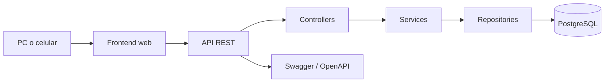
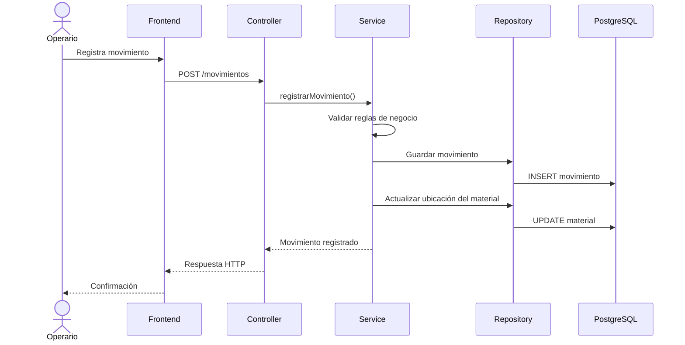
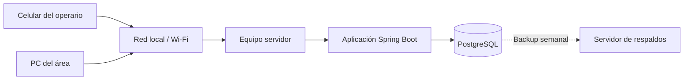

# Arquitectura del Sistema

## Índice

- [Objetivo](#objetivo)
- [Arquitectura general](#arquitectura-general)
- [Frontend](#frontend)
- [Backend](#backend)
- [Base de datos](#base-de-datos)
- [Flujo de registro de un movimiento](#flujo-de-registro-de-un-movimiento)
- [Integración con códigos QR](#integración-con-códigos-qr)
- [Despliegue](#despliegue)
- [Consistencia de los movimientos](#consistencia-de-los-movimientos)
- [Decisiones relacionadas](#decisiones-relacionadas)

## Objetivo

La arquitectura del sistema busca separar la interfaz utilizada por los operarios, la lógica de negocio y la persistencia de datos.

La aplicación se ejecutará dentro de la red local de la fábrica y podrá utilizarse desde computadoras y dispositivos móviles mediante un navegador web.

## Arquitectura general

El sistema utilizará una arquitectura web por capas.



La comunicación entre frontend y backend se realizará mediante solicitudes HTTP y respuestas en formato JSON.

## Frontend

El frontend será desarrollado utilizando:

- HTML.
- CSS.
- JavaScript.

La interfaz será responsive para permitir su utilización desde computadoras y teléfonos celulares.

El frontend será responsable principalmente de:

- Mostrar información al usuario.
- Permitir consultas.
- Mostrar formularios.
- Registrar datos ingresados por el usuario.
- Mostrar advertencias y resultados de las operaciones.
- Comunicarse con la API REST.

Entre las pantallas previstas se encuentran:

- Inicio de sesión.
- Listado de transformadores.
- Detalle de transformador.
- Consulta de materiales.
- Consulta de ubicaciones.
- Registro de movimientos.
- Historial de movimientos.
- Administración.

El diseño detallado de las interfaces se realizará en la etapa correspondiente.

## Backend

El backend será desarrollado utilizando Java y Spring Boot.

La aplicación se organizará inicialmente en las siguientes capas.

### Controllers

Recibirán las solicitudes HTTP provenientes del frontend.

Sus responsabilidades principales serán:

- Recibir los datos de las solicitudes.
- Validar el formato básico de entrada.
- Invocar los servicios correspondientes.
- Devolver las respuestas HTTP.

### Services

Contendrán la lógica de negocio.

Entre sus responsabilidades estarán:

- Gestionar transformadores.
- Gestionar materiales.
- Gestionar ubicaciones.
- Validar movimientos.
- Verificar la asociación entre materiales y transformadores.
- Mostrar advertencias cuando corresponda.
- Registrar movimientos.
- Actualizar la ubicación actual de los materiales.
- Registrar observaciones.
- Aplicar reglas de acceso según el usuario.

### Repositories

Gestionarán el acceso a los datos utilizando Spring Data JPA.

Serán responsables de consultar y persistir las entidades almacenadas en PostgreSQL.

### Entities

Representarán las entidades principales definidas en el modelo de datos:

- Usuario.
- Area.
- Ubicacion.
- Transformador.
- Material.
- Movimiento.
- Observacion.

### DTO

La API podrá utilizar objetos de transferencia de datos para separar los datos expuestos mediante los endpoints de las entidades utilizadas internamente por JPA.

## Base de datos

La aplicación utilizará PostgreSQL.

La base de datos almacenará:

- Usuarios.
- Áreas.
- Ubicaciones.
- Transformadores.
- Materiales.
- Movimientos.
- Observaciones.

Las relaciones se gestionarán desde el backend mediante Spring Data JPA e Hibernate.

El número real del transformador será utilizado como su identificador.

La identificación del proveedor, por ejemplo UN20 o K486, será almacenada como texto en el transformador y será compartida por sus materiales mediante la relación existente entre ambas entidades.

## Flujo de registro de un movimiento

El registro de un movimiento seguirá aproximadamente el siguiente flujo:



## Integración con códigos QR

Los códigos QR estarán asociados a ubicaciones físicas.

No se colocarán códigos QR individuales sobre cada material durante la primera versión.

El flujo previsto será:

```text
Escanear QR
    ↓
Identificar ubicación
    ↓
Mostrar información de la ubicación
    ↓
Consultar materiales o iniciar un movimiento
```

El código permitirá acceder rápidamente a la ubicación correspondiente desde un dispositivo conectado a la red interna.

## Despliegue

La aplicación funcionará dentro de la red local de la fábrica.



Los dispositivos cliente deberán estar conectados a la red interna.

La primera versión no dependerá de una conexión permanente a Internet.

Las copias de seguridad se almacenarán en un equipo diferente del servidor principal.

## Consistencia de los movimientos

El registro de un movimiento y la actualización de la ubicación actual del material representan una única operación lógica.

Cuando un movimiento se confirme correctamente:

1. Se registrará el movimiento.
2. Se actualizará la ubicación actual del material.

Ambas operaciones deberán realizarse de manera transaccional.

Si ocurre un error durante el proceso, el sistema deberá evitar que quede:

- Un movimiento registrado sin actualizar la ubicación.
- Una ubicación actual modificada sin conservar el movimiento correspondiente.

Esta lógica será responsabilidad de la capa de servicios.

## Decisiones relacionadas

La arquitectura se encuentra relacionada con las siguientes decisiones:

- [ADR-001 — Aplicación web](adr/ADR-001-arquitectura-web.md)
- [ADR-003 — Stack backend](adr/ADR-003-stack-backend.md)
- [ADR-004 — Uso de códigos QR](adr/ADR-004-uso-de-qr.md)
- [ADR-005 — Despliegue web local](adr/ADR-005-despliegue-web-local.md)
- [ADR-006 — PostgreSQL](adr/ADR-006-base-de-datos-postgresql.md)
- [ADR-007 — Modelo de ubicación actual e historial](adr/ADR-007-modelo-ubicaciones-movimientos.md)