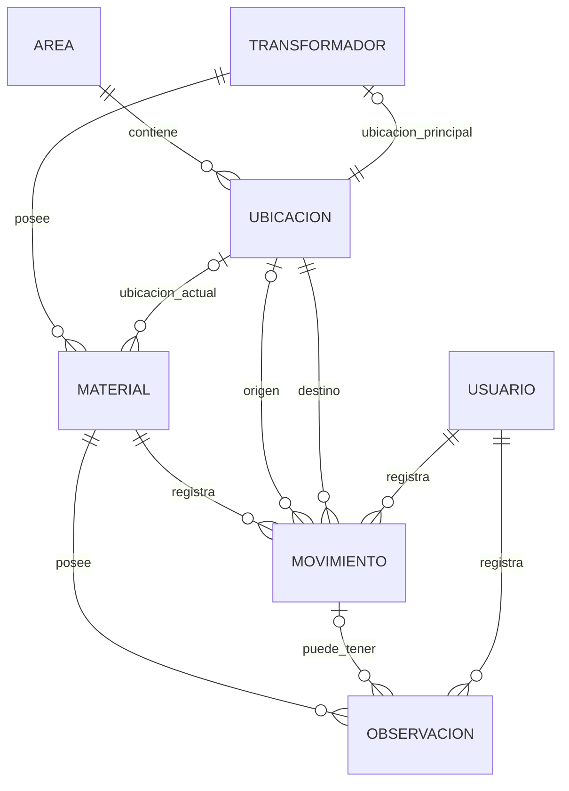
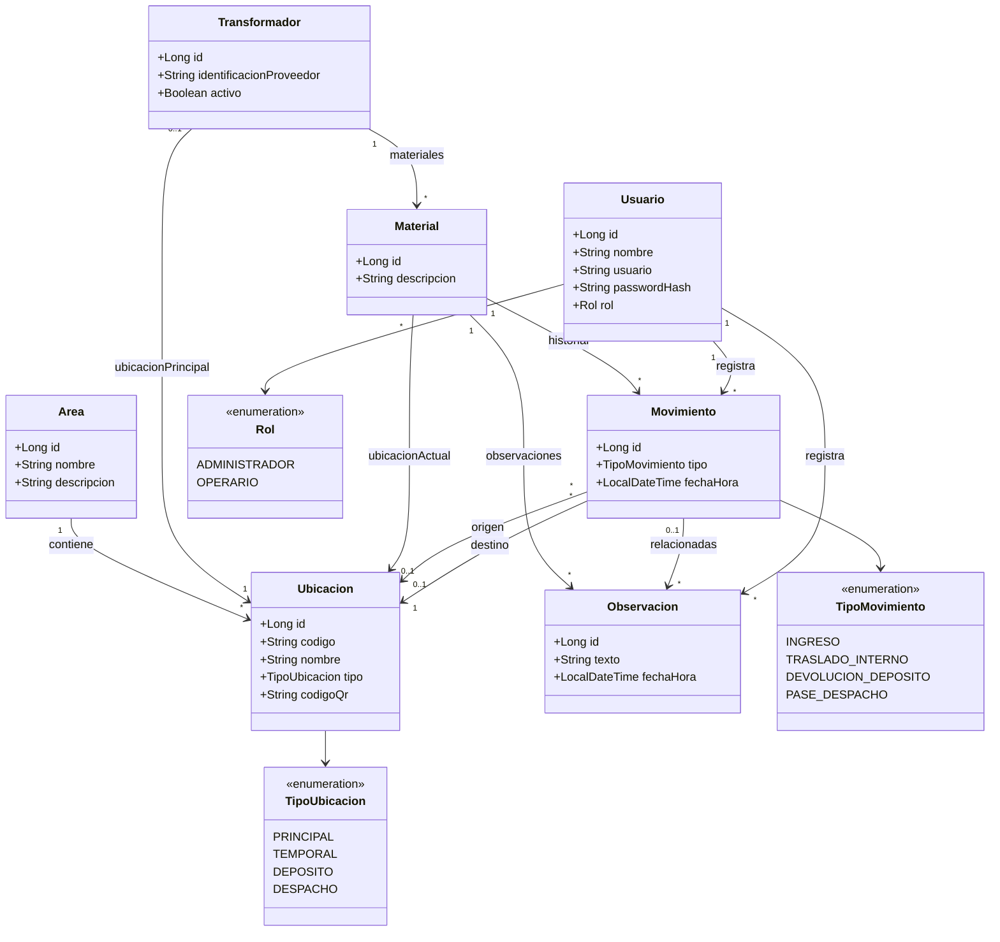

# Modelo de Datos

## Índice

- [Objetivo](#objetivo)
- [Entidades principales](#entidades-principales)
- [Relaciones y cardinalidades](#relaciones-y-cardinalidades)
- [Restricciones y decisiones del modelo](#restricciones-y-decisiones-del-modelo)
- [Diagrama entidad-relación](#diagrama-entidad-relación)
- [Diagrama de clases](#diagrama-de-clases)

## Objetivo

El modelo de datos representa la información necesaria para registrar la trazabilidad de materiales asociados a transformadores dentro de áreas productivas.

La primera versión estará enfocada en el área de Terminación, pero el modelo permitirá incorporar otras áreas en el futuro.

Las entidades principales son:

- Usuario.
- Área.
- Ubicación.
- Transformador.
- Material.
- Movimiento.
- Observación.

## Entidades principales

### Usuario

Representa a una persona habilitada para utilizar el sistema.

| Campo | Descripción |
|---|---|
| id | Identificador interno del usuario |
| nombre | Nombre del usuario |
| usuario | Identificador utilizado para acceder al sistema |
| passwordHash | Contraseña almacenada de forma segura |
| rol | Rol asignado |

Los roles iniciales serán:

- ADMINISTRADOR.
- OPERARIO.

### Area

Representa un área productiva dentro de la fábrica.

| Campo | Descripción |
|---|---|
| id | Identificador interno |
| nombre | Nombre del área |
| descripcion | Descripción opcional |

La primera área utilizada será Terminación.

Posteriormente podrán incorporarse otras áreas como Bobinado, Montaje Parte Activa y Preestabilizado.

### Ubicacion

Representa una ubicación física en la que pueden encontrarse materiales.

| Campo | Descripción |
|---|---|
| id | Identificador interno |
| codigo | Código de la ubicación |
| nombre | Nombre o descripción |
| tipo | Tipo de ubicación |
| codigoQr | Identificador utilizado para el código QR |
| area | Área a la que pertenece |

Los tipos iniciales podrán ser:

- PRINCIPAL.
- TEMPORAL.
- DEPOSITO.
- DESPACHO.

### Transformador

Representa un transformador dentro del proceso productivo.

| Campo | Descripción |
|---|---|
| id | Número real y único del transformador, por ejemplo 6674, 6682 o 6785 |
| identificacionProveedor | Identificación asignada por el proveedor, por ejemplo UN20 o K486 |
| ubicacionPrincipal | Ubicación principal asignada para sus materiales |
| activo | Indica si el transformador continúa activo dentro del proceso |

No se utilizará un `codigo` adicional, ya que el número real del transformador será directamente su identificador.

La `identificacionProveedor` será de tipo texto porque puede contener tanto letras como números.

Cada transformador tendrá una única identificación de proveedor y dicha identificación no deberá reutilizarse para otro transformador.

Todos los materiales asociados al transformador comparten dicha identificación.

### Material

Representa un material que debe ser trazado.

| Campo | Descripción |
|---|---|
| id | Identificador interno del material |
| descripcion | Tipo o descripción del material |
| transformador | Transformador al que pertenece |
| ubicacionActual | Última ubicación registrada; puede no existir hasta registrar el primer movimiento |

La identificación del proveedor no se almacenará nuevamente en Material.

Se obtendrá mediante la relación con Transformador.

Por ejemplo:

```text
Transformador 6682
Identificación proveedor: UN20

Materiales:
- Tanque
- Tapa
- Caño
- Válvula
```

Todos estos materiales estarán asociados al transformador 6682 y, por lo tanto, compartirán la identificación UN20.

### Movimiento

Representa un cambio de ubicación de un material.

| Campo | Descripción |
|---|---|
| id | Identificador interno |
| tipo | Tipo de movimiento |
| fechaHora | Fecha y hora del registro |
| material | Material involucrado |
| origen | Ubicación anterior |
| destino | Nueva ubicación |
| usuario | Usuario que registró el movimiento |

Los tipos iniciales serán:

- INGRESO.
- TRASLADO_INTERNO.
- DEVOLUCION_DEPOSITO.
- PASE_DESPACHO.

La ubicación de origen podrá ser opcional en determinados ingresos iniciales.

La ubicación de destino será obligatoria.

### Observacion

Representa información adicional registrada por un usuario.

| Campo | Descripción |
|---|---|
| id | Identificador interno |
| texto | Contenido |
| fechaHora | Fecha y hora |
| material | Material relacionado |
| movimiento | Movimiento relacionado, cuando corresponda |
| usuario | Usuario que registró la observación |

## Relaciones y cardinalidades

### Area — Ubicacion

**Cardinalidad: 1:N**

Un área puede contener muchas ubicaciones.

Cada ubicación pertenece a una única área.

```text
Area 1 ───── N Ubicacion
```

### Transformador — Material

**Cardinalidad: 1:N**

Un transformador puede tener muchos materiales.

Cada material pertenece a un único transformador.

```text
Transformador 1 ───── N Material
```

### Transformador — Ubicacion principal

**Cardinalidad: 1:1, con asociación opcional desde Ubicacion**

Cada transformador tendrá una única ubicación principal asignada para sus materiales.

Una ubicación podrá ser la ubicación principal de cero o un transformador.

Las ubicaciones temporales, de depósito o de despacho no necesitan estar asociadas como ubicación principal a un transformador.

```text
Transformador ───── 1 Ubicacion principal

Ubicacion ───── 0..1 Transformador
```

### Ubicacion — Material

**Cardinalidad: 1:N, con ubicación actual opcional para el material**

Una ubicación puede contener varios materiales.

Cada material podrá tener cero o una ubicación actual registrada.

Un material recién registrado podrá no tener todavía una ubicación conocida hasta que se registre su primer movimiento.

```text
Ubicacion 1 ───── N Material

Material ───── 0..1 Ubicacion actual
```

### Material — Movimiento

**Cardinalidad: 1:N**

Un material puede tener muchos movimientos.

Cada movimiento corresponde a un único material.

```text
Material 1 ───── N Movimiento
```

### Ubicacion — Movimiento como origen

**Cardinalidad: 1:N, con origen opcional para el movimiento**

Una ubicación puede aparecer como origen de muchos movimientos.

Cada movimiento podrá tener cero o una ubicación de origen.

El origen podrá no estar registrado en determinados ingresos iniciales.

```text
Ubicacion 1 ───── N Movimiento
            origen

Movimiento ───── 0..1 Ubicacion origen
```

### Ubicacion — Movimiento como destino

**Cardinalidad: 1:N**

Una ubicación puede ser destino de muchos movimientos.

Cada movimiento deberá tener exactamente una ubicación de destino.

```text
Ubicacion 1 ───── N Movimiento
            destino

Movimiento ───── 1 Ubicacion destino
```

### Usuario — Movimiento

**Cardinalidad: 1:N**

Un usuario puede registrar muchos movimientos.

Cada movimiento es registrado por un único usuario.

```text
Usuario 1 ───── N Movimiento
```

### Material — Observacion

**Cardinalidad: 1:N**

Un material puede tener muchas observaciones.

Cada observación estará asociada a un único material.

```text
Material 1 ───── N Observacion
```

### Movimiento — Observacion

**Cardinalidad: 1:N, con asociación opcional desde Observacion**

Un movimiento puede tener ninguna o varias observaciones asociadas.

Una observación podrá estar relacionada con cero o un movimiento.

```text
Movimiento 1 ───── N Observacion
```

La asociación desde Observacion hacia Movimiento será opcional.

### Usuario — Observacion

**Cardinalidad: 1:N**

Un usuario puede registrar muchas observaciones.

Cada observación será registrada por un único usuario.

```text
Usuario 1 ───── N Observacion
```

## Restricciones y decisiones del modelo

### Identificador del transformador

El número real del transformador será utilizado directamente como clave identificadora.

Por ejemplo:

- 6674.
- 6682.
- 6785.

No se almacenará otro campo `codigo` con el mismo valor.

### Identificación del proveedor

Cada transformador tendrá una identificación de proveedor única.

Esta identificación se encuentra grabada físicamente en los materiales pertenecientes al transformador.

Ejemplos:

- UN20.
- UN46.
- UN86.
- K486.

Debido a que el formato puede contener letras y números, se almacenará como texto.

La aplicación no generará ni modificará automáticamente este valor.

La identificación del proveedor no deberá reutilizarse entre transformadores.

### Materiales e identificación del proveedor

La identificación de proveedor no se almacenará repetidamente en cada material.

El sistema la obtendrá a partir del transformador al cual pertenece el material.

Esto evita duplicar información y mantiene una única fuente para el dato.

### Ubicación actual

El material almacenará una referencia a su ubicación actual para permitir consultas rápidas.

Cuando se registre un movimiento:

1. Se guardará el movimiento.
2. Se actualizará la ubicación actual con el destino.

Ambas operaciones deberán ejecutarse de manera consistente.

### Historial

Los movimientos registrados se conservarán aunque posteriormente cambie la ubicación del material.

La ubicación actual no reemplaza el historial.

### Códigos QR

Los códigos QR estarán asociados a ubicaciones.

No existirán códigos QR individuales para los materiales durante la primera versión.

### Eliminación de información histórica

No deberá eliminarse información necesaria para reconstruir el historial de movimientos.

La política definitiva de bajas y desactivaciones se definirá antes de implementar las operaciones administrativas.

## Diagrama entidad-relación



## Diagrama de clases

